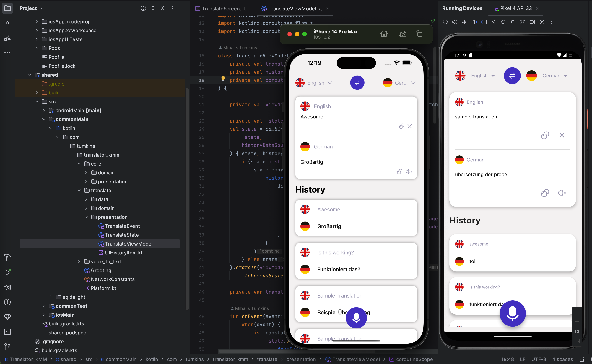

# Kotlin Multiplatform translator app (iOS & Android)

Features:
- Interacting with remote APIs in KMM projects using Ktor
- Working with local databases in KMM using SQLDelight
- Reactive programming using Kotlin Flows and observing these on all platforms
- Shared ViewModels and state mapping logic between Android & iOS
- UI using Jetpack Compose and SwiftUI
- Dependency injection in KMM projects
- Theming on Android & iOS